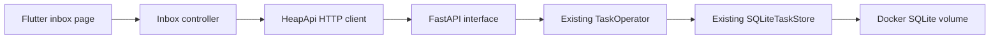

# Heap framework setup plan

Barrett approved implementation by the existing Frontend and Backend agents after a planning subagent. The immediate deliverable is a real server-backed inbox with Docker deployment, Android use, and a web-capable Flutter foundation. This does not implement the remaining domain roadmap.

## Choices

- Backend: FastAPI, Uvicorn, and Pydantic adapt HTTP to the existing Python operations. Flask would require more manual validation; standard-library HTTP would add routing work without helping the app.
- Frontend: Material 3, `package:http`, immutable response data, and built-in `ChangeNotifier`/`ListenableBuilder`. Inject dependencies directly. Keep 1 real inbox screen; do not add empty destinations or a routing/state package without a current need.
- Data: server-backed only, with visible unavailable/retry states. No offline cache, queued edits, sync, or optimistic capture.
- Deployment: Docker/Compose, durable SQLite directory volume, non-root execution, private host publication. Use HTTPS for releases; allow HTTP only in Android debug builds.
- Scope: GET health, GET inbox, POST capture. Later task organization, recommendation, recurrence, and project screens will use the same API/operation boundary as they are agreed and implemented.

See [api-contract.md](api-contract.md) for the frozen shared contract and configuration.

## Responsibilities and small interfaces

Names below describe intended responsibilities; agents may adjust local names without changing the shared HTTP contract.

| Component | Responsibility / public operations |
| --- | --- |
| Flutter `HeapApi` | Injected HTTP client and server origin; fetch inbox and capture a title; return immutable task data or classified request errors |
| Flutter inbox controller | Load/refresh, capture, loading/saving/error state, stale-response suppression, disposal; expose data to the page |
| Flutter inbox page | Display state and collect user input; never apply ranking or persistence rules |
| Python application factory | Configuration, store lifetime, serialization lock, HTTP routes and error mapping |
| Python request/response types | Strict title input and explicit UUID/UTC serialization of snapshots |
| Existing `TaskOperator` | `capture(title)` and `list_inbox()`; same authoritative operations used by tests and future interfaces |
| Existing SQLite store | Explicit persisted snapshots; retained in the mounted data directory |

## Exclusive file ownership

Both agents work in `/home/barrett-lowe/PersonalDev/Heap-ui` on `feat/flutter-ui`. Leave `/home/barrett-lowe/PersonalDev/Heap` on `master` untouched.

| Owner | Writable paths |
| --- | --- |
| Backend | `src/heap/interface/**`, `tests/interface/**`, `pyproject.toml`, `uv.lock`, `Dockerfile`, `compose.yaml`, `.dockerignore`, `docs/backend.md` |
| Frontend | `ui/**`, including tests, dependencies, Android/web setup, and `ui/README.md` |
| Coordinator | Root `README.md`, `TASKS.md`, `AGENTS.md`, `.pair-log.md`, `.gitignore` if needed, `docs/api-contract.md`, `docs/framework-plan.md` |
| No edits in this step | Existing logic/persistence files, existing core tests, original spec |

Do not reset, clean, stash, switch branches, overwrite the prototype with project generation, stage, commit, or push. Request coordinator approval for any out-of-scope path or contract change. Reviewer subagents follow the same ownership boundaries and should report findings rather than edit.

## Work and verification

1. Backend implements and tests the HTTP interface and container configuration. Verify real SQLite capture/list/reopen, validation and errors, CORS, same-thread serialized operations, core regression tests, Docker health, and volume persistence across container recreation.
2. Frontend replaces temporary storage with the API/controller and usable loading/error/retry/capture states. Verify draft preservation, duplicate-submit prevention, unknown write outcomes, obsolete GET handling, and confirmed-save/failed-refresh behavior. Run analysis, tests, Android build, and web build.
3. Each implementation agent spawns its own `openai/gpt-6.1-sol` reviewer with high reasoning. Review owned new files as well as tracked diffs. Fix substantive findings, rerun tests, and request follow-up review until findings are resolved. Do not substitute a different review model without asking Barrett.
4. Agents report changed paths, exact checks/results, review findings/fixes, remaining limitations, and any required user action to the coordinator.
5. Coordinator checks integrated behavior: start Compose, capture/list from Android, retain tasks across app/container restarts, check unavailable/retry behavior, and verify web build/CORS where available. Phone/browser checks remain pending unless actually performed.

Stop after this slice. Record only verified progress in `TASKS.md`; organization is a later agreed change.
