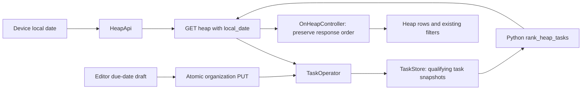

# Heap ranking implementation plan

Status: implementation and V1 verification complete. B1–B5, F1–F7, and D1 are complete; both independent reviews approved. V2 is partially verified: Firefox, Android emulator, timezone-change/resume, and Designer screenshot review passed. Physical-phone and live full-keyboard/screen-reader checks remain unverified. No deployment, commit, or push occurred.

## Progress and verification

- [x] B1–B5 — backend due-date storage, organization, ranking, HTTP contract, and Heap integration implemented and verified.
- [x] F1–F7 — Flutter date models, transport, editor, list order/completion, row display, and local-date resume implemented and verified.
- [x] D1 — Designer handoff and final visual approval complete.
- [x] V1 — coordinator: 343 Python tests, 208 Flutter tests, clean analysis, web/debug APK builds, and whitespace checks. Backend independent review approved (39 probes; tests strengthened); Frontend review #23 approved (208 tests, 21 editor tests, 17 scratch probes).
- [x] V1 live integration — isolated HTTP/API restart snapshots, ranked ordering, P1 protection, deadline promotion, completion/undo, stale 409, and date/age preservation verified. Firefox and emulator verified picker/save/rerank, grey completion, undo/reload, and date clearing. Firefox failed-refresh recovery retained grey rows with an accessible stale warning, then removed them after recovery. Isolated services/browser/emulator were closed and reset.
- [x] V2 — Firefox and Android emulator flows; 320 logical-pixel/2× row/editor/picker screenshots with no overflow; Designer final approval of standard web, Android, and narrow/large-text screens. Live timezone change from America/New_York (Oct 5) to Pacific/Kiritimati (Oct 6) changed order on resume as expected; restoring timezone was verified.
- [ ] V2 — physical-phone verification (no phone connected).
- [ ] V2 — live full-keyboard and screen-reader checks.

All test servers and isolated browser/emulator test state were closed/reset. No production deployment was performed. The API contract requires `local_date` on Heap GETs and `due_date` on organization/bulk responses; deploy backend and client together to avoid contract mismatch.

## Agreed behavior

- P1 Critical always ranks ahead of P2–P5.
- A task due today, tomorrow, or overdue can cross at most 1 priority level. P2 cannot enter the protected P1 group.
- Within the resulting ranking level: earliest due date, undated last, then oldest `on_heap_since`, then task ID for exact ties.
- Age alone never crosses priority levels. Use entry time, not creation or last edit.
- Show the full Heap. Do not introduce project caps, project-priority weights, short-task bonuses, dependency filtering, or context filtering.
- Manual waiting does not affect rank or visibility; preserve its badge.
- Add an optional, clearable date-only Due date to the editor. Past dates are valid.
- Interpret today/tomorrow using the viewing device's current local date, including when traveling. Due dates themselves never shift through UTC conversion.
- Completing a row retains its position, metadata, and grey appearance until a successful list reload. Undo preserves its original age and due date.

Examples with local today = `2026-10-05`:

| Task | Ranking group |
| --- | --- |
| P1, any due date or none | 1 |
| P2, any due date or none | 2 |
| P3, due on/before `2026-10-06` | 2 |
| P3, due `2026-10-07` or undated | 3 |
| P4, due on/before `2026-10-06` | 3 |
| P5, due on/before `2026-10-06` | 4 |
| P5, undated | 5 |

A promoted P3 due tomorrow beats undated P2 because both enter group 2 and the dated task comes first. A native P2 with an earlier due date can still lead that group. Promotion never edits the saved priority label.

## Approved technical contract

1. Python remains the only ranking authority. Use a small pure ranking function, not a weighted-score engine, new strategy hierarchy, or SQL ranking expression.
2. Request `GET /api/v1/heap?local_date=YYYY-MM-DD`. Require a valid calendar date; return 422 if missing or malformed rather than guessing server-local today. The client supplies its current local date on every load. A timezone name/package is unnecessary because the only time input is today's calendar date.
3. Persist nullable `due_date` as canonical `YYYY-MM-DD`. Require this nullable field in bulk Inbox/detail/Heap responses and in full organization PUTs. Keep title-only capture unchanged; its confirmed default is no due date. Completion response uses the expanded detail shape.
4. Keep the existing SQLite initialization style: add 1 nullable column through the existing column list and update reads/writes. Do not build a migration system or reset a user's task list for this feature.
5. Preserve server-returned list order in Flutter. Remove the existing age-only sorts rather than copying Python's ranking into Dart. Confirmed editor saves use the existing background list refresh to get authoritative placement.
6. On reload/resume, evaluate the device's current date. Reload on resume if the calendar date changed, but not during an open editor/capture flow or pending completion write; defer until safe. A continuously foregrounded screen reranks on its next refresh, not automatically at midnight. A midnight timer is out of scope unless Barrett requests it.
7. Approved presentation addition: show the actual due date in the row's wrapping metadata, omitted when null and neutral grey when completed. This makes deadline-driven ordering visible. Designer owns exact layout in `docs/heap-ranking-design.md`; the row addition is approved.

Step 0 freezes these choices before dependent tasks begin. Requiring the new query/body fields means backend and UI must be released together; do not silently clear dates from an old editor request.

## Responsibilities and interfaces

Frozen interfaces:

- `Task.due_date: datetime.date | None`.
- `TaskOperator.organize_task(..., due_date: date | None)`: replace due date alongside existing fields in the same save. No separate due-date setter/API is needed.
- `rank_heap_tasks(tasks: Sequence[Task], *, today: date) -> list[Task]`, in `src/heap/logic/task_ranking.py`: return a new ordered list without mutation, clock reads, or database writes.
- `TaskOperator.list_on_heap(*, today: date) -> list[Task]`: retrieve qualifying snapshots, then call the pure ranking function. Update all callers/tests explicitly; no implicit server-clock fallback.
- `OrganizationService.listOnHeap({required String localDate})`: client date must be canonical. `HeapApi` sends it as a query parameter; the controller supplies it.
- Flutter `CalendarDate`: a small date-only value in `ui/lib/calendar_date.dart`, with validated year/month/day, strict canonical parsing/formatting, equality, conversion to/from picker/local calendar values. Do not store a due date as an instant or call `toUtc()` on it.
- `InboxTask.dueDate`, inherited by `TaskDetail`, plus `OrganizationDraft.dueDate`: `CalendarDate?`. Submission serialization, field equality, and recovery matching include it.
- `OnHeapController` accepts a local clock callback for tests, defaulting to `DateTime.now`. A load captures the local date once and passes it to `listOnHeap`.

The repository already contains `TaskRanker`, `PriorityAgeStrategy`, and `tests/test_task_ranking.py`, but the Heap endpoint does not call that score-based path. Its capped/additive age policy differs from this agreement. Leave the legacy score helper and its existing tests untouched for this slice; add the explicit-date Heap policy separately and wire only that policy to `/heap`. Do not create or overwrite `tests/test_task_ranking.py` as though it were new. Any later removal of the unused score path needs its own agreed cleanup.

No new state-management package, ranking metadata column, or persisted promoted priority is needed.

## Task cards

Every card owns its listed files. Read those files and the relevant existing tests before coding. Write the failing test first, implement only the card, then run its tests. Stop at the acceptance gate; do not expand scope or start a dependent card without a handoff.

### 0. Freeze contract and approve presentation

Owner: coordinator with Backend, Frontend, Designer and Barrett. Depends on: this plan.

- All 7 proposals above are approved, including the required query and due-date row display.
- Add the exact request/response examples and errors to `docs/api-contract.md`; use current `on_heap`, `on_heap_since`, and `/heap` names, not historical On-deck transport names.
- Designer owns `docs/heap-ranking-design.md`. Coordinator owns this plan, API contract, and `TASKS.md`; the spec is not in this documentation-only scope.
- Record `docs/heap-ranking-fixture.json`, a shared machine-readable ordering fixture with canonical task attributes and expected ID orders for 2 local dates. Freeze names/signatures before parallel code starts.

Acceptance: signatures, ranking semantics, field nullability, date format, presentation scope, and release behavior are frozen in this documentation. Step 0 is verified only after the API contract and shared fixture agree with these signatures.

### B1. Task date and SQLite round trip

Owner: Backend storage. Depends on: 0. Files: `task.py`, `sqlite_task_store.py`, new `tests/test_task_due_date_storage.py`.

- Add nullable date field with default `None`; update insert/upsert and every SELECT/decode path, including project task listing.
- Add the nullable column using existing initialization machinery.
- Test null, past/future dates, leap day, reopen, explicit-save snapshots, bulk save, and existing rows defaulting to null.

Acceptance: every task read path preserves the same calendar date; no timestamp/status/priority changes. Whole persistence suite passes.

### B2. Atomic organization includes due date

Owner: Backend operations. Depends on: B1. Files: `task_operator.py`, `tests/test_task_organization.py`, new `tests/test_task_due_date_operations.py`.

- Add the due-date argument to organization and update Python callers/fixtures.
- Date-only edits preserve placement and Heap age. Identical date is a no-op; null clears it.
- Test completed-write rejection, save failure, and preservation of project/waiting/dependencies.
- Test completion, undo, and normalization retain due date. Ensure date edits advance the comparison token even with an equal/backward clock; keep no-op behavior unchanged.

Acceptance: 1 atomic organization save, no date-driven qualification or age reset, and no stale token reuse from a date edit.

### B3. Pure ranking function

Owner: Backend ranking. Depends on: B1. Files: new `task_ranking.py`, new `tests/test_heap_ranking_policy.py` only.

- Implement ranking groups from the example table. Use calendar-date comparison, not elapsed hours.
- Sort by group, dated-before-undated, due date, Heap age, and ID.
- Test all P1 protections, P3 vs undated P2, P4/P5 promotion, no promotion after tomorrow, old vs new within a group, and stable exact ties.
- Include leap-day/month/year boundaries, maximum supported date, waiting true/false, and shuffled input producing identical output.
- Assert inputs and task snapshots are unchanged. This function only sorts already qualifying unfinished tasks; it is not a new eligibility engine.

Acceptance: deterministic results with explicit `today`; no dependence on storage, current time, Flutter, or weights.

### B4. Date HTTP contract

Owner: Backend HTTP. Depends on: B2. Files: `app.py`, organization/detail/Inbox/completion API tests.

- Validate required nullable `due_date` in organization; serialize it in all expanded task responses. Keep capture unchanged.
- Accept only canonical real `YYYY-MM-DD` strings or null; reject timestamps, booleans/numbers, normalized invalid dates, missing/extra fields.
- Test GET/PUT/reopen, clearing, no-op, stale conflict, failed save, and existing CORS/error envelopes.
- Include date-only conflict and stale token tests. Completion/undo responses retain dates.

Acceptance: HTTP and stored values match exactly; omitted date cannot accidentally clear a saved date.

### B5. Serve authoritative ranked Heap

Owner: Backend HTTP/ranking integration. Depends on: B3, B4. Files: `task_operator.py`, `app.py`, Heap operator/API tests and affected Python callers.

- Require/validate `local_date` query, pass it to the operator, and sort in Python after retrieval.
- Do not change Inbox order or the store's membership query. SQL does not compute ranking.
- Test the shared mixed-priority/date fixture through HTTP for 2 different local dates. Verify repeated GETs do not change tokens or database snapshots.
- Update old age-order assertions only where the agreed ranking supersedes them.

Acceptance: real Heap endpoint returns every qualifying unfinished task in agreed order; missing/invalid dates return the documented error.

### F1. Flutter calendar date and task models

Owner: Frontend models. Depends on: 0. Files: new `calendar_date.dart`, `inbox_task.dart`, `task_detail.dart`, new date/model tests.

- Implement strict date-only representation, including rejection of impossible dates rather than Dart's normalizing constructor behavior.
- Add due date to task/draft constructors, decode, equality, serialization, and submitted-vs-fetched matching.
- Capture remains title-only and explicitly undated. Required bulk metadata cannot be guessed from a missing field.
- Update affected constructor/JSON fixtures as a single-owner change; do not change service signatures yet.

Acceptance: round-trip canonical dates and null; no UTC shift; due-only draft differences and uncertain matching are covered.

### F2. Flutter service/query and completion validation

Owner: Frontend transport. Depends on: F1. Files: `heap_api.dart`, `on_heap_controller.dart` date parameter plumbing only, `task_flow_fakes.dart`, transport tests and affected service fakes.

- Add required local date to `listOnHeap`, encode query through `Uri`, and inject a test clock into the controller. Capture the date once per load.
- Recognize `due_date` field errors. Validate completion responses preserve due date along with other metadata.
- Update every fake/service implementation and fixture; preserve unrelated diagnostic logging already in this file.
- Test exact query/body, wrong/missing/malformed date response, null, date-only lost-response matching, and unknown writes without automatic resubmission.

Acceptance: analysis and transport tests pass against mocked step-0 contract. Live backend is not needed for this card.

### F3. Editor controller preserves due-date drafts

Owner: Frontend editor state. Depends on: F1. Files: `task_editor_controller.dart`, `task_editor_controller_test.dart`.

- Add due-date edit/clear with explicit change flag so null means clear rather than unchanged.
- Preserve date through unrelated edits and both conflict choices. Include it in dirty state and field-error clearing.
- Update warning copy listing overwritten fields to include due date.
- Test date-only dirty/no-op, clear, rejection, conflict-only-in-date, uncertain matching/differing result, and preservation during pending writes.

Acceptance: date behaves exactly like existing editable fields; no picker or HTTP calls are implemented here.

### D1. Due-date presentation handoff

Owner: Designer. Depends on: 0. Files: `docs/heap-ranking-design.md` only.

- Specify an optional date field after Duration, separate clear action, Material picker cancellation/focus, and completed/read-only/conflict summaries.
- If approved in step 0, specify actual due-date row metadata and neutral completed treatment. Never change the saved priority badge to the promoted ranking group.
- Specify truthful list copy replacing any old oldest-first claim.

Acceptance: Frontend has concrete narrow/large-text/web guidance. No arbitrary today-based lower date limit or restriction excluding existing valid saved dates.

### F4. Editor date control and summaries

Owner: Frontend editor UI. Depends on: F2, F3, D1. Files: `task_editor_page.dart`, new `due_date_field.dart` if useful, editor widget tests.

- Add picker and clear action. Both change only the draft; picker cancel changes nothing; existing Save writes all fields together.
- Include due date in read-only, conflict, saved, and preserved-draft summaries, error focus, and overwritten-field explanation.
- Allow past dates; accommodate the agreed representable date range and any valid saved date. Explain any picker platform limitation before coding around it.
- Test date-only dirty cancel, same-date no-op, clear, rejected/uncertain save, pending disabling, keyboard focus return, 320 width/2× text, and web layout.

Acceptance: usable optional date editor with existing cancel/save guards; no automatic write from a picker.

### F5. Preserve authoritative order and completion positions

Owner: Frontend list state. Depends on: F2, B5's frozen ordered-response fixture. Files: `on_heap_controller.dart`, `on_heap_completion_test.dart`, list-controller tests; adjust ordering fakes only after F2 hands them off.

- Remove `_byAge` and the age-only sort in `applyConfirmed`. Do not replace them with a Dart ranking implementation.
- A successful load preserves response order exactly. Existing row replacement, completion, undo, and recovery update in place.
- For editor saves: preserve existing position or append a newly qualifying task provisionally, keep stale/pending-refresh labeling, then use the existing post-save GET for final placement.
- For undo after a concurrent reload removed the row: retain the pre-write index/neighbor IDs and restore without sorting other tasks. If placement cannot be recovered, append provisionally and label stale until the next reload; do not trigger an unrequested reload that removes other grey rows.
- Keep read-version protection and uncertainty locks. Filters remain a stable subset of the returned order.
- When recovery or delayed undo inserts a row missing from the latest server response, that position is provisional even if its former slot is known. Keep `stale` true and a reachable refresh/status-check action; `load()` must not unconditionally clear the warning after reinserting recovery rows. Only a later authoritative list containing the resolved row establishes its current ranked position.

Acceptance: shared ranked fixture is never age-resorted; completion/undo does not move grey rows, lose confirmed undo, clear uncertainty early, or alter other row positions. Test distinct neighboring IDs.

### F6. List presentation

Owner: Frontend list UI. Depends on: D1, F1, F5. Files: `task_widgets.dart`, `inbox_page.dart`, relevant row/list widget tests; `heap_style.dart` only if the approved style needs it.

- Replace stale oldest-first wording wherever present.
- If approved, add actual due-date metadata without changing duration/filter meanings or saved priority.
- Preserve neutral grey completed metadata, separate 48-pixel completion target, and editor body semantics.

Acceptance: accurate copy, date wrapping/semantics, 320 width/2× text and wide-web tests; unchanged undated rows and existing completion controls.

### F7. Follow local date on safe resume

Owner: Frontend screen lifecycle. Depends on: F2, F5. Files: `task_lists_page.dart`, lifecycle/list tests.

- Track the last successful ranking date. Every ordinary load already uses the current device local date.
- On app resume, reload only when local date differs. Defer during editor/capture or pending completion; trigger once when safe. Same-date resume does not issue another GET or remove grey rows.
- Preserve existing explicit refresh, stale/error states, focus, and scroll behavior. Do not add a timer or rerank by moving local rows.

Acceptance: midnight/timezone-crossing resume sends the new date; same-date resume is a no-op; pending/editor/capture races and failed reload retain safeguards.

### V1. Integrated tests and independent review

Owner: coordinator verifies; independent reviewer reviews. Depends on: B5, F4, F6, F7.

- Run the full Python suite, Flutter analysis/tests, web build, and Android build.
- Exercise capture → date/priority Save → ranked list → complete → undo → reload against an isolated real API/database. Check persistence after restart.
- Probe 409 conflicts, date-only uncertain saves, completion response loss, refresh during undo, and device/server date disagreement.
- Review backend and Flutter independently; delegate corrections to the owning implementer and rerun tests. Do not count implementation as verification.

Acceptance: all agreed behaviors work together and review blockers are fixed. Keep remote deployment/production data outside isolated tests.

### V2. Visual/device verification and final docs

Owner: coordinator with Designer. Depends on: V1.

- Verify physical phone and emulator, plus web keyboard flow. Use actual narrow/large-text screenshots for Designer review.
- Check real date picker, due-date save/clear, row order, grey completion metadata, undo, timezone/local-date behavior, and failed reload.
- Update this plan, design, contract, spec, and `TASKS.md` with what was actually verified. Keep device checks pending if hardware is unavailable.
- Build/release/commit/push only when requested. This planning request authorizes none of those actions.

Acceptance: verified work is checked off, limitations are explicit, and no unfinished roadmap items are claimed complete.

## Parallel schedule and file locks

`+` means safe parallel work after the preceding dependencies are satisfied. Parallelism is optional; do not add agents merely to fill slots.

| Wave | Work that can run in parallel | Locks / conditions |
| --- | --- | --- |
| 0 | Step 0 only | Coordinator freezes contract and presentation scope |
| 1 | B1 + F1 + D1 | Python storage, Dart models/fixtures, design document are separate |
| 2 | B2 + B3 + F2 + F3 | B3 owns only new ranking module/tests; F2 owns transport/list date plumbing/fakes, F3 only editor controller/tests |
| 3 | B4 + F4 + F5 | Backend HTTP, editor page, list controller are separate; F2 must release controller/fakes first |
| 4 | B5 + F6 + F7 | Python integration, row UI, page lifecycle are separate; F5 must be complete |
| 5 | Backend independent review + Flutter independent review + coordinator integration checks | Implementation paused while checks run; corrections go back to file owners |
| 6 | V2 device checks and Designer screenshot review | Shared docs remain coordinator-owned except Designer's document |

F5 may use the frozen ordered fixture before B5 is complete; live integration waits for B5. Do not run F2 and F5 concurrently: both touch `on_heap_controller.dart`. Do not run B2 and B5 concurrently: both touch `task_operator.py`. B4 and B5 both touch `app.py` and must remain sequential. F6 and F7 can run together only if F6 does not edit `task_lists_page.dart`; hand off copy changes through F7 if that is where they live.

## Instructions for each small-model assignment

Provide the agent with 1 card, step-0 contract/examples, its prerequisite handoff, relevant existing test commands, and its allowed files. Require this completion report:

1. Files changed and public signatures.
2. Failing tests observed before implementation.
3. Tests run and their result.
4. Decisions still blocked or limitations found.

Do not ask a small model to implement the entire backend/UI in 1 assignment. The coordinator integrates shared fixtures/documents, resolves ambiguous requirements, and owns the final verification. Preserve the already-uncommitted phone-beta network/logging changes; do not stage, overwrite, or revert them as part of ranking.

## Step 0 documentation handoff

Status: complete and verified. The exact signatures above, `docs/api-contract.md`, and `docs/heap-ranking-fixture.json` are consistent. No code changed in step 0. The legacy score helper remains untouched.

## First slice

Historical sequencing note: B1/B3 and F1/D1 were the first implementation slice. All implementation cards and V1 are complete; only the explicitly listed V2 device-check limitations remain.
