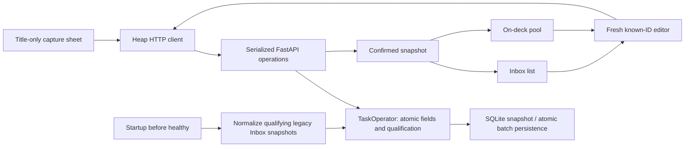

# Inbox → editor → automatic On-deck plan

**Approved:** Barrett lifted the planning pause and authorized this revision. Include the reference's other bottom tabs even without destination pages. Planning subagent #5 completed the revised plan and atomic startup-normalization refinement before implementation. The previous explicit-move plan is superseded.

## Agreed scope

Build the server-backed capture → fresh editor → one atomic Save → automatic Inbox/On-deck workflow. Priority and known duration qualify unfinished tasks; no separate move action or manually chosen membership flag. Clearing requirements returns Inbox; restoring them returns On-deck automatically. Keep `on_deck_since`: ordinary qualifying edits preserve age; re-entry starts a new age. No ranking implementation.

The existing manual `externally_blocked` flag means `Awaiting external dependencies`, not hidden. Edit it alongside title/priority/duration in the one Save; organized waiting tasks remain visible On-deck with a badge. No reason text or dependency editor.

Follow the supplied image as the primary visual target: bold Heap/mountain branding, colored P1-highest priority pills/dots, clock metadata, mostly unboxed divider rows, restrained pale interaction highlights, and the reference's Tasks / Today / Capture + / Projects / Settings bottom toolbar. Tasks contains the functional Inbox/On-deck inner selector. Today/Projects/Settings are visible Soon placeholders, unavailable without fake pages, API calls, or selection changes. Designer's accepted amendment defines responsive 2-row fallback without shrinking scaled text.

Title-only capture opens from the plus; preserve its prior safety behavior and in-memory drafts. Keep Material 3, ordinary Navigator and existing injected HTTP/state boundaries. No fake task descriptions/projects/filtering, ranking, completion/history, recurrence, authentication, offline cache/queue/sync, or implementation of placeholder destinations.

The frozen JSON/error/recovery semantics are in [api-contract.md](api-contract.md); presentation in [task-flow-design.md](task-flow-design.md). Coordinator read and accepted the final toolbar amendment; Backend and Frontend have implementation GO in their owned paths.

## Responsibilities and ownership

All agents use `/home/barrett-lowe/PersonalDev/Heap-ui`, branch `feat/flutter-ui`, baseline `2ebe3cb`. Preserve all existing work and the original `Heap` worktree.

| Owner | Writable paths |
| --- | --- |
| Backend | `src/heap/interface/**`; `src/heap/logic/task_operator.py`; `src/heap/logic/task_store.py`; `src/heap/persistence/sqlite_task_store.py`; backend `tests/**`; `docs/backend.md` |
| Frontend | `ui/**`, tests/builds and `ui/README.md` |
| Designer | `docs/task-flow-design.md` only; source/screenshots read-only |
| Coordinator | Shared contract/plan, root README/TASKS/AGENTS/.pair-log, spec; Git only when authorized |
| Reviewers | Read-only source/docs; checks and temporary probes permitted |

No cross-owner edits, Git index/branch/reset/stash/commit/push, schema/dependency/deployment expansion, shared SDK/config changes, or preview-volume destruction. Temporary artifacts/screenshots belong under `/tmp`. The preview contains user data (including Plan Hive Build); do not overwrite unrelated tasks or delete retained volumes.

## Structure

### Backend

- `organize_task(task_id, *, title, priority, duration, externally_blocked)` replaces the 4 editable fields from a fresh snapshot. Reject completed/missing state before time/write; HTTP checks the saved token within the serialized operation.
- Share a small non-saving qualification/transition rule among relevant snapshot-edit operations, including priority/duration setters. Completed snapshots remain terminal. Preserve unrelated data; no chained committing setters.
- Qualification drives queries/placement; stored lifecycle snapshots may remain internal but are not an independently editable membership decision. On-deck includes waiting/blocked tasks and orders by age then ID, not score.
- Final no-op reads no time/saves nothing. Otherwise read UTC once and save once. Keep exact age when remaining qualified; clear it on leaving; initialize it on entry.
- `TaskStore.list_unfinished()` / SQLite counterpart is a read-only scan irrespective qualification/waiting. This keeps qualification-based Inbox queries from hiding legacy candidates.
- `normalize_organization() -> int`: use that scan to select qualifying legacy Inbox snapshots in Python, read UTC once only if any change, preserve unrelated fields/flags, initialize real normalization age and update token, then commit 1 atomic batch before reporting count.
- `TaskStore.save_many(tasks: list[Task]) -> None` / SQLite implementation commits all or none; empty does nothing. Reuse upsert SQL for single/bulk without nested committing saves.
- Run normalization explicitly during lifespan after store initialization and before state publication/healthy. Fail startup on normalization failure. No GET/list writes, historical ages, schema field, or migration marker.
- Capture POST stays 5 fields; Inbox GET adds required priority/duration/waiting metadata; detail/On-deck add required waiting. PUT requires waiting and removes `move_to_on_deck` (extra field →422). Preserve strict validation/CORS/token/error behavior.

### Frontend

- Preserve separate fresh saved/draft/submitted/comparison state. Remove move intention/button/helpers, derive expected unfinished status from submitted priority/duration only.
- Include waiting in dirty checks, validation, summaries, transport, confirmed list updates and recovery matching. One atomic Save; no independently saving checkbox.
- Keep explicit conflict/uncertain choices. Keep my edits retains the visibly compared draft's 4 fields and adopts the fresh token/status; disclose all 4 replacements. No automatic write on choices/GET.
- Validate bulk metadata without per-row detail calls/guesses. Capture's 5-field response has guaranteed initial defaults; list metadata absence is not null/false.
- Implement the finalized reference-led design, expanded toolbar placeholders, capture sheet, waiting badge/checkbox and responsive forms.
- Fix carried-forward P2: late post-save refresh must not steal capture focus or replay an earlier row focus after newer navigation. Regression with delayed GET completers/new input and route visit required.
- Preserve list scroll positions, lazy ordinary On-deck load, obsolete-read invalidation, capture safety, successful-save/failed-refresh truth, read-only terminal drafts and no-auto-retry recovery.

## Order and verification

1. Coordinator freezes corrected contract/plan and records approval. Designer supplies the small authorized toolbar amendment; Backend starts the approved domain/API correction in parallel.
2. Frontend receives GO after final toolbar handoff, works against corrected fakes in parallel with Backend. Owners report settled source, changed paths, tests/builds and any blockers; no self-spawned reviews.
3. Coordinator spawns fresh independent `openai/gpt-6.1-sol` reviews at high reasoning for settled Backend/Frontend source, including untracked files. Route findings to owners; repeat fixes/checks/review until clean. Old 218/61 tests and prior reviews cover the superseded flow only.
4. Coordinator runs real Android/browser integration against retained Compose SQLite and collects new screenshots. Designer compares them side by side with the actual reference, not merely its document. Fix/reverify findings.
5. Update progress only after verification. Stop at this batch; no commits/pushes without authorization.

Backend tests cover both setter orders/atomic qualification; each/both clears and automatic restoration; completed terminal behavior; true/false waiting inclusion and age independence; no-op/time/save counts; stale/completed/missing/invalid/obsolete-key rejection; rollback and reopening of all fields/flags/links; stable ordering; strict metadata/UUID/date/JSON/Unicode/CORS contracts. Startup tests cover mixed legacy data, shared actual timestamp, exact preservation, rollback of a later failed row, no-op/idempotence and failed startup/health. Retain valid direct-store legacy fixtures; do not remove unrelated regression coverage to make changed-policy tests pass. Run full pytest/coverage.

Frontend checks cover exact requests/required metadata/flags/nulls/token, full-body timeout and malformed/wrong-ID uncertainty, dirty/back/disposal/races, one Save/autoplacement/flag-only changes, all conflict and reconciliation outcomes, no automatic writes, capture sheet dismissal/newer-input preservation, placeholder no-op semantics, focus regression and enlarged layouts. Run analysis/tests and Android debug/release/web builds.

Live tests: persisted capture/edit/automatic On-deck/reopen; ordinary age preservation; clear/restore each requirement; waiting flag both ways remains organized; stale editor; dropped committed PUT response reconciled by known ID without duplicate writes; server outage/retry; app/page/container restart persistence. Screenshots include narrow and wide lists, capture/editor with a FULL docked Android keyboard, 320 width/2x text/open menus/scrolled actions and recovery/error states. Floating IME toolbar alone is not keyboard-inset proof. Physical-phone/VPN, real HTTPS deployment and store-ready signing remain unverified unless actually exercised.
